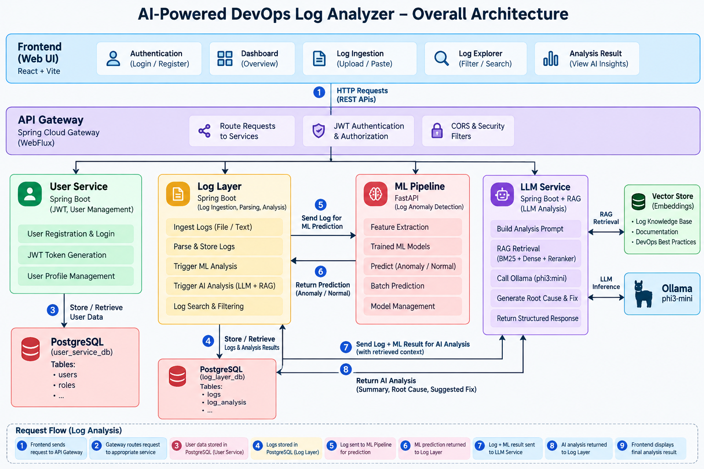
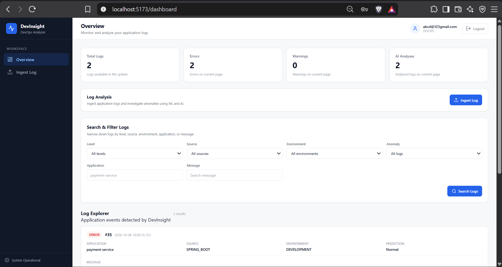
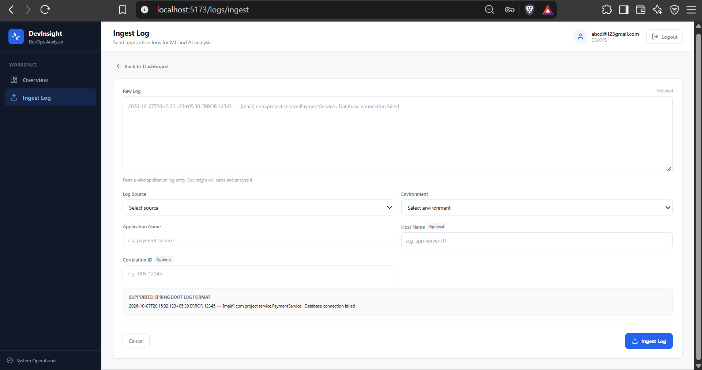
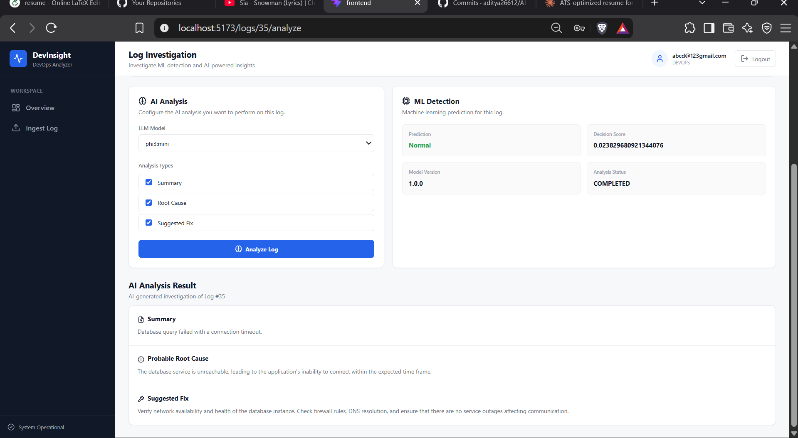

# AI-Powered DevOps Log Analyzer & Incident Assistant

An AI-powered DevOps platform that ingests application logs, detects anomalies, analyzes incidents, and uses an LLM with a DevOps knowledge base to generate explanations and recommended actions.

The project is organized as a monorepo containing the backend services, ML pipeline, LLM/RAG service, and React frontend.

---

## Architecture




The system follows a layered microservice architecture:

- **Frontend** — React/Vite interface for log ingestion, exploration, and investigation.
- **API Gateway** — Spring Cloud Gateway for routing, authentication, authorization, and CORS handling.
- **User Service** — JWT-based authentication and user management.
- **Log Layer** — log ingestion, parsing, persistence, search, and orchestration of ML/LLM analysis.
- **ML Pipeline** — FastAPI-based anomaly detection and feature extraction.
- **LLM Service** — RAG-based investigation using BM25, dense retrieval, and Ollama.
- **PostgreSQL** — persistent storage for users and logs.
- **Ollama** — local LLM inference.


---

## Application Preview

### Dashboard

The dashboard provides an overview of ingested logs, error/warning counts,
AI analyses, and searchable log records.



### Log Ingestion

Logs can be submitted through the web interface together with their source,
environment, application, and optional infrastructure metadata.



### AI-Powered Log Investigation

The investigation workflow combines ML detection with RAG-powered LLM
analysis to produce a summary, probable root cause, and suggested fix.



## Retrieval-Augmented Generation

The LLM service uses a hybrid retrieval architecture combining:

- Dense retrieval
- BM25 lexical retrieval
- Reciprocal Rank Fusion (RRF)
- Experimental reranking approaches

The retrieval pipeline was evaluated on a fixed internal benchmark before selecting the current configuration.

For the complete experiment methodology, measurements, negative results, and final design decision, see:

[→ RAG Retrieval Experiments & Final Decision](docs/rag_retrieval_experiments_and_final_decision.md)


---

## 1. What This Project Does

The platform is designed around the following flow:

```text
                         ┌──────────────────────┐
                         │     React Frontend   │
                         │       :5173          │
                         └──────────┬───────────┘
                                    │
                                    ▼
                         ┌──────────────────────┐
                         │     API Gateway      │
                         │       :8080          │
                         │ Spring Cloud Gateway │
                         │      WebFlux         │
                         └──────────┬───────────┘
                                    │
                       ┌────────────┴────────────┐
                       │                         │
                       ▼                         ▼
              ┌─────────────────┐       ┌─────────────────┐
              │   User Service  │       │    Log Layer    │
              │      :8081      │       │      :8082      │
              │ JWT + PostgreSQL│       │ PostgreSQL      │
              └─────────────────┘       └────────┬────────┘
                                                 │
                                      ┌──────────┴──────────┐
                                      │                     │
                                      ▼                     ▼
                              ┌───────────────┐     ┌───────────────┐
                              │  ML Pipeline  │     │  LLM Service  │
                              │     :8000     │     │     :8084     │
                              │ Anomaly       │     │ RAG + Ollama  │
                              │ Detection     │     │               │
                              └───────────────┘     └───────┬───────┘
                                                           │
                                                           ▼
                                                    ┌────────────┐
                                                    │   Ollama   │
                                                    │   :11434   │
                                                    └────────────┘
```

### Main workflow

```text
Log ingestion
     ↓
Log parsing + validation
     ↓
PostgreSQL persistence
     ↓
ML anomaly detection
     ↓
LLM incident analysis
     ↓
RAG retrieval from DevOps knowledge
     ↓
Summary + probable root cause + recommendation
     ↓
Frontend Dashboard
```

---

# 2. Monorepo Structure

```text
AI-Powered-DevOps-Log-Analyzer-Incident-Assistant/
│
├── api-gateway/          # Reactive API Gateway + JWT security
├── user-service/         # Authentication, registration, users
├── log-layer/            # Log ingestion, persistence, ML/LLM integration
├── ml-pipeline/          # ML anomaly detection and feature processing
├── llm-service/          # LLM analysis + RAG pipeline
├── frontend/             # React/Vite frontend
│
├── docs/                 # Project documentation
├── README.md
└── .gitignore
```

The repositories were migrated using Git subtree so the original Git histories remain available inside the monorepo.

Secrets were sanitized before migration and environment-variable placeholders are used for runtime credentials.

---

# 3. Services

| Component | Port | Main Responsibility |
|---|---:|---|
| API Gateway | `8080` | Routing, JWT security, CORS |
| User Service | `8081` | Registration, login, user operations |
| Log Layer | `8082` | Log ingestion, storage, ML/LLM orchestration |
| ML Pipeline | `8000` | Log feature processing and anomaly prediction |
| LLM Service | `8084` | Incident analysis and RAG-based reasoning |
| Frontend | `5173` | Web dashboard |
| PostgreSQL | `5432` | Persistent application data |
| Ollama | `11434` | Local LLM runtime |

---

# 4. Technology Stack

## Backend

- Java 21
- Spring Boot
- Spring Cloud Gateway
- Spring WebFlux
- Spring Security
- Spring Data JPA
- PostgreSQL
- Maven
- WebClient

## ML

- Python
- Uvicorn
- Existing ML pipeline for anomaly detection and log feature processing

## LLM / RAG

- Spring AI
- Ollama
- `phi3:mini`
- `nomic-embed-text:latest`
- Dense vector retrieval
- BM25 lexical retrieval
- Reciprocal Rank Fusion (RRF)
- Retrieval evaluation using Hit@1, Hit@3, Hit@5 and MRR

## Frontend

- React
- Vite
- Axios
- React Router
- Lucide React

---

# 5. Prerequisites

Before running the complete project locally, install:

### Required

- Java 21
- Maven
- Python 3.x
- Node.js + npm
- PostgreSQL
- Ollama
- Git

### Verify installations

```powershell
java -version
mvn -version
python --version
node --version
npm --version
psql --version
ollama --version
git --version
```

The project was developed and tested locally with Java 21.

---

# 6. PostgreSQL Setup

The current local configuration expects PostgreSQL.

The User Service uses:

```text
Database: devinsight
Port:     5432
Username: postgres
```

The Log Layer uses:

```text
Database: log_layer_db
Port:     5432
Username: postgres
```

Create the databases before starting the backend services if they do not already exist.

Example:

```sql
CREATE DATABASE devinsight;
CREATE DATABASE log_layer_db;
```

The database password should be supplied through an environment variable rather than committed to Git.

---

# 7. Ollama Setup

The LLM Service uses Ollama locally.

Start Ollama and make sure it is available at:

```text
http://localhost:11434
```

The project currently uses:

```text
Chat model:
phi3:mini

Embedding model:
nomic-embed-text:latest
```

Pull the required models if they are not already installed:

```powershell
ollama pull phi3:mini
ollama pull nomic-embed-text:latest
```

Verify Ollama:

```powershell
ollama list
```

The LLM Service depends on Ollama being available when actual LLM analysis is performed.

---

# 8. Environment Variables

Do not commit actual secrets.

The project uses environment-variable placeholders such as:

```text
DB_PASSWORD
JWT_SECRET
INTERNAL_API_KEY
```

Example local PowerShell configuration:

```powershell
$env:DB_PASSWORD="<your-postgres-password>"
$env:JWT_SECRET="<your-jwt-secret>"
```

The ML Pipeline also requires:

```powershell
$env:INTERNAL_API_KEY="<your-local-internal-api-key>"
```

These values are session-level examples and should be replaced with your own local values.

---

# 9. Running the Project Locally

The current verified approach is to run each service separately before moving to Docker Compose.

## Terminal 1 — ML Pipeline

From:

```text
ml-pipeline/
```

Set the required local key:

```powershell
$env:INTERNAL_API_KEY="<your-local-key>"
```

Start:

```powershell
python -m uvicorn app.main:app --host 0.0.0.0 --port 8000
```

The service should be available at:

```text
http://localhost:8000
```

---

## Terminal 2 — User Service

From the monorepo root:

```powershell
$env:DB_PASSWORD="<your-postgres-password>"
$env:JWT_SECRET="<your-jwt-secret>"

mvn -f .\user-service\pom.xml spring-boot:run
```

Runs on:

```text
http://localhost:8081
```

---

## Terminal 3 — Log Layer

Set the required database environment variable:

```powershell
$env:DB_PASSWORD="<your-postgres-password>"
```

Start:

```powershell
mvn -f .\log-layer\pom.xml spring-boot:run
```

Runs on:

```text
http://localhost:8082
```

The Log Layer communicates with:

```text
ML Pipeline → http://localhost:8000
LLM Service  → http://localhost:8084
```

---

## Terminal 4 — LLM Service

From:

```text
llm-service/
```

Start the Spring Boot service using Maven:

```powershell
mvn spring-boot:run
```

Runs on:

```text
http://localhost:8084
```

Make sure Ollama is running before testing LLM analysis.

---

## Terminal 5 — API Gateway

From the monorepo root:

```powershell
mvn -f .\api-gateway\pom.xml spring-boot:run
```

Runs on:

```text
http://localhost:8080
```

The Gateway routes requests to the User Service and Log Layer.

---

## Terminal 6 — Frontend

From:

```text
frontend/
```

Install dependencies if required:

```powershell
npm install
```

Start:

```powershell
npm run dev
```

Open:

```text
http://localhost:5173
```

---

# 10. API Gateway

The Gateway is a reactive Spring Cloud Gateway application using WebFlux.

### Routes

```text
/api/v1/auth/**  → User Service :8081
/api/v1/users/** → User Service :8081
/api/v1/logs/**  → Log Layer :8082
```

### Authentication

Normal protected API requests require a JWT.

The Gateway validates the token and establishes the authenticated reactive security context.

CORS preflight requests are explicitly allowed:

```java
.pathMatchers(HttpMethod.OPTIONS, "/**")
.permitAll()
```

Normal API requests remain protected:

```java
.anyExchange()
.authenticated()
```

---

# 11. User Service API

### Register

```http
POST /api/v1/auth/register
```

Example:

```json
{
  "email": "user@example.com",
  "password": "password",
  "role": "DEVELOPER"
}
```

### Login

```http
POST /api/v1/auth/login
```

Example:

```json
{
  "email": "user@example.com",
  "password": "password"
}
```

The login response contains a JWT token.

### Current user

```http
GET /api/v1/users/me
```

Requires:

```text
Authorization: Bearer <token>
```

---

# 12. Log Layer API

### Ingest a log

```http
POST /api/v1/logs
```

Request contains fields such as:

```text
rawLog
source
environment
applicationName
hostName
correlationId
```

### Get a log

```http
GET /api/v1/logs/{id}
```

### Search logs

```http
POST /api/v1/logs/search
```

The frontend Dashboard uses this endpoint for the Log Explorer.

### Analyze a log

```http
POST /api/v1/logs/{id}/analyze
```

Example analysis types include:

```text
SUMMARY
ROOT_CAUSE
SUGGESTED_FIX
```

### Delete a log

```http
DELETE /api/v1/logs/{id}
```

The Log Layer also maintains separate ML and LLM analysis lifecycle information.

---

# 13. ML Pipeline

The ML Pipeline exposes:

```text
POST /api/v1/predict
POST /api/v1/predict/batch
GET  /api/v1/system/health
GET  /api/v1/system/model
```

A prediction contains information such as:

```text
prediction
prediction_label
is_anomaly
decision_score
model_version
```

The current anomaly convention includes:

```text
-1 → Anomaly
 1 → Normal
```

The Log Layer communicates with the ML Pipeline using its configured service URL.

---

# 14. LLM Service

The LLM Service provides:

```text
POST /api/v1/llm/analyze
GET  /api/v1/system/health
GET  /test
```

The analysis request can contain:

```text
timestamp
level
service_name
message
prediction
prediction_label
decision_score
model_version
```

The response can include:

```text
summary
rootCause
severity
recommendation
```

The service uses Ollama for local LLM inference.

---

# 15. RAG Pipeline

The LLM Service contains a DevOps knowledge base.

Current knowledge base:

```text
21 Markdown documents
```

Categories:

```text
Docker       → 5
Kubernetes   → 5
Nginx        → 3
PostgreSQL   → 3
Spring Boot  → 5
```

The knowledge files are stored under:

```text
llm-service/src/main/resources/knowledge/
```

The stable retrieval architecture currently uses:

```text
Knowledge Documents
        ↓
1000-character chunks
        ↓
        ┌───────────────────┐
        │                   │
        ▼                   ▼
Dense Retrieval        BM25 Retrieval
        │                   │
        └─────────┬─────────┘
                  ▼
             RRF Fusion
                  ↓
          Candidate Results
                  ↓
          Prompt Construction
                  ↓
                 LLM
```

The current stable configuration uses:

```text
Chunk size    = 1000 characters
Chunk overlap = 0
```

---

# 16. RAG Evaluation

RAG retrieval was evaluated using a fixed 20-query DevOps benchmark.

Metrics:

```text
Hit@1
Hit@3
Hit@5
MRR
```

The benchmark covers:

```text
Spring Boot
Docker
Kubernetes
Nginx
PostgreSQL
```

### Stable results

| Retrieval Strategy | Hit@1 | Hit@3 | Hit@5 | MRR |
|---|---:|---:|---:|---:|
| Dense, no overlap | 80% | 100% | 100% | 0.9000 |
| BM25, no overlap | 75% | 95% | 100% | 0.8542 |
| Hybrid RRF, no overlap | 75% | 95% | 100% | 0.8542 |

These are internal benchmark results and should not be interpreted as general RAG performance claims.

---

# 17. RAG Experiments

Several retrieval experiments were performed.

## Chunk overlap

A 200-character overlap was tested.

It reduced benchmark performance:

```text
Dense:
MRR 0.9000 → 0.8500

BM25:
MRR 0.8542 → 0.8042

Hybrid:
MRR 0.8542 → 0.8042
```

Decision:

```text
1000-character chunks
0 overlap
```

## Lexical reranker

A simple lexical reranker was tested:

```text
Hybrid RRF
    ↓
Lexical Reranker
```

Result:

```text
Hit@1 = 70%
Hit@3 = 95%
Hit@5 = 100%
MRR   = 0.8292
```

This was worse than the Hybrid RRF baseline.

## TF-IDF-inspired reranker

A second reranking experiment used TF-IDF-inspired weighting.

Result:

```text
Hit@1 = 70%
Hit@3 = 90%
Hit@5 = 95%
MRR   = 0.8017
```

This was also worse than the Hybrid RRF baseline.

### Current conclusion

The experiments support keeping:

```text
1000-character chunks
+
Dense Retrieval
+
BM25
+
RRF
```

while treating the lexical and TF-IDF-inspired rerankers as experimental approaches that did not improve this benchmark.

The detailed experiment documentation is included in:

```text
docs/rag_retrieval_experiments_and_final_decision.md
```

---

# 18. Frontend

The frontend is a React/Vite application.

Main areas include:

```text
Login
Registration
Dashboard
Log Explorer
Log Ingestion
Log Analysis
```

The Dashboard provides:

- Total log count
- Error count
- Warning count
- AI analysis count
- Severity filtering
- Source filtering
- Environment filtering
- Application filtering
- Anomaly filtering
- Message search
- Pagination
- Log details
- Analyze action
- Delete action

The frontend communicates with the API Gateway rather than calling backend services directly.

---

# 19. Local Smoke Test

The complete local system was tested before Docker Compose work.

Verified:

```text
ML Pipeline                  PASS
User Service                 PASS
Log Layer                    PASS
LLM Service                  PASS
API Gateway                  PASS
Frontend                     PASS
Gateway authentication       PASS
CORS preflight               PASS
Dashboard log loading       PASS
Frontend → Gateway           PASS
Gateway → Log Layer          PASS
GitHub push                  PASS
Working tree clean           PASS
```

The Dashboard successfully loaded logs from the backend.

---

# 20. CORS Issue and Fix

During local frontend integration, the Dashboard initially failed to load logs.

The browser reported a CORS preflight failure.

Direct testing showed:

```text
OPTIONS /api/v1/logs/search
→ 401 Unauthorized
```

The problem was Spring Security requiring authentication for the browser's CORS preflight request.

The fix was:

```java
.pathMatchers(HttpMethod.OPTIONS, "/**")
.permitAll()
```

while retaining:

```java
.anyExchange()
.authenticated()
```

After the fix:

```text
OPTIONS /api/v1/logs/search
→ 200 OK
```

with the expected CORS headers.

The fix was committed as:

```text
749009b fix(api-gateway): allow CORS preflight requests
```

and pushed to `main`.

---

# 21. Security and Secrets

Real credentials should never be committed.

The project uses environment variables such as:

```text
DB_PASSWORD
JWT_SECRET
INTERNAL_API_KEY
```

Examples should use placeholders:

```text
<your-postgres-password>
<your-jwt-secret>
<your-local-key>
```

The monorepo `.gitignore` excludes:

```text
.env
.env.*
```

while allowing:

```text
.env.example
```

---

# 22. Known Limitations

Current known limitations include:

### Multiline / stack-trace logs

Some multiline or stack-trace-style logs are currently rejected with:

```text
400 INVALID_LOG_FORMAT
```

### Log collection endpoint

There is currently no:

```http
GET /api/v1/logs
```

collection endpoint.

The frontend uses:

```http
POST /api/v1/logs/search
```

instead.

### Registration role selection

The current registration flow allows the client to provide a role.

For a public production deployment, role assignment should be restricted or controlled server-side.

---

# 23. Development Sequence

The project follows this deployment progression:

```text
Complete and test locally
        ↓
Monorepo verification
        ↓
Docker Compose integration
        ↓
Frontend + container verification
        ↓
Kubernetes deployment
```

The local multi-service setup has been tested successfully.

Docker Compose is the next major deployment step.

---

# 24. Docker Compose

Docker Compose integration is the next phase of the project.

The Compose setup should eventually provide the services and supporting infrastructure as containers:

```text
Frontend
API Gateway
User Service
Log Layer
ML Pipeline
LLM Service
PostgreSQL
Ollama
```

Container-specific service names and URLs should replace `localhost` references where appropriate.

The Compose configuration should be added and tested before documenting final container commands in this README.

**This README is therefore intentionally written before Docker Compose is finalized. It should be updated after Compose integration with the exact build, startup, health-check, environment-variable, volume, model-download and shutdown commands.**

---

# 25. Recommended First-Time Setup

A new contributor should follow this order:

```text
1. Clone repository
        ↓
2. Install prerequisites
        ↓
3. Configure PostgreSQL
        ↓
4. Install/pull Ollama models
        ↓
5. Configure environment variables
        ↓
6. Start ML Pipeline
        ↓
7. Start User Service
        ↓
8. Start Log Layer
        ↓
9. Start LLM Service
        ↓
10. Start API Gateway
        ↓
11. Start Frontend
        ↓
12. Login
        ↓
13. Open Dashboard
        ↓
14. Ingest / inspect / analyze logs
```

---

# 26. Project Documentation

Important documentation includes:

```text
README.md
docs/rag_retrieval_experiments_and_final_decision.md
```

The RAG experiment note contains the detailed retrieval experiments, benchmark results, chunk-overlap evaluation, BM25 evaluation, Hybrid RRF evaluation, and reranker experiments.

---

# 27. Project Status

Current status:

```text
Monorepo migration                 ✅
Git history preservation           ✅
Secret sanitization                ✅
Backend integration                ✅
ML integration                     ✅
LLM integration                    ✅
RAG pipeline                       ✅
RAG benchmark                      ✅
Frontend integration               ✅
JWT authentication                 ✅
CORS configuration                 ✅
Local end-to-end smoke test        ✅
Docker Compose                     ⏳ Next
Kubernetes deployment              ⏳ Later
```

---

# 28. Summary

This project is an AI-powered DevOps log analysis platform combining:

```text
Microservices
+
JWT-secured API Gateway
+
PostgreSQL
+
ML anomaly detection
+
LLM-based incident analysis
+
DevOps RAG
+
Dense retrieval
+
BM25
+
RRF fusion
+
React dashboard
```

The RAG component was not treated as a black-box feature. Retrieval strategies were experimentally compared using a fixed benchmark, and changes that reduced measured performance were rejected.

The current stable retrieval configuration is:

```text
1000-character chunks
0 overlap
Dense retrieval
BM25 retrieval
Reciprocal Rank Fusion
```

