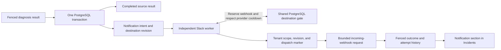

# Notification architecture

```mermaid
flowchart LR
    Diagnosis["Fenced diagnosis result"] --> Commit["One PostgreSQL transaction"]
    Commit --> Source["Completed source result"]
    Commit --> Intent["Notification intent and destination revision"]
    Intent --> Claim["Independent Slack worker"]
    Claim <-->|"Reserve webhook and respect provider cooldown"| Rate["Shared PostgreSQL destination gate"]
    Claim --> Guard["Tenant scope, revision, and dispatch marker"]
    Guard --> HTTP["Bounded incoming-webhook request"]
    HTTP --> Result["Fenced outcome and attempt history"]
    Result --> UI["Notification section in Incidents"]
```

Alert creation, incident lifecycle, and provider acknowledgement are separate state changes.
